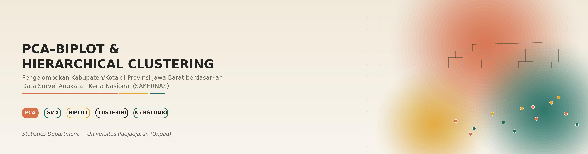
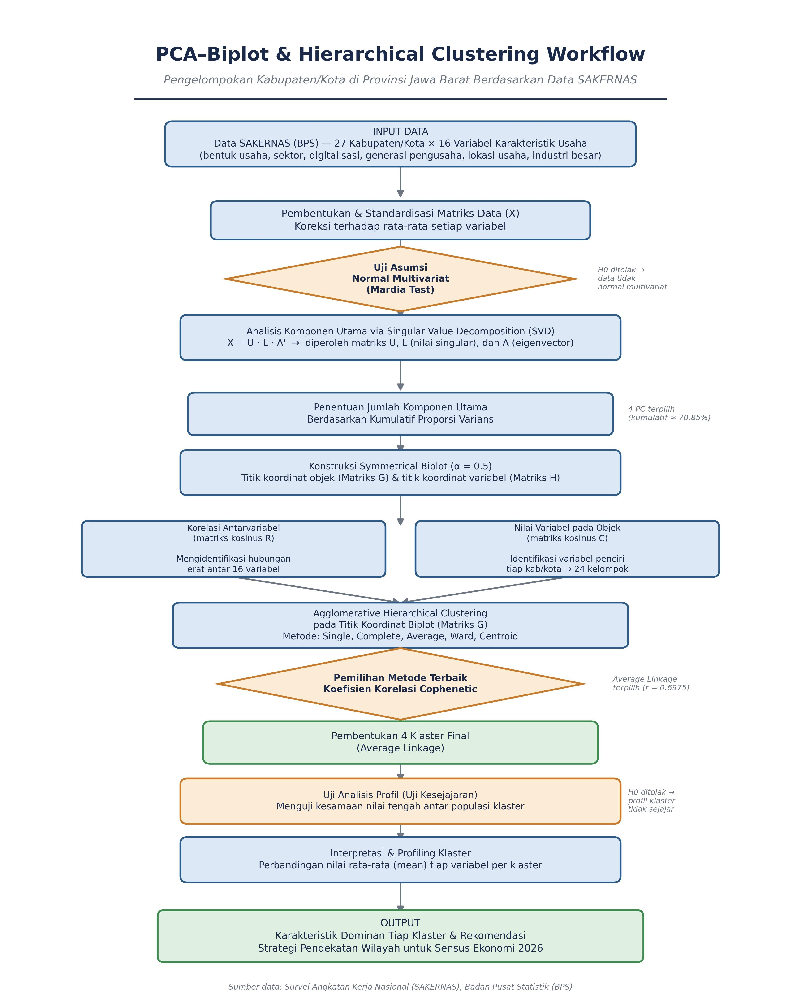
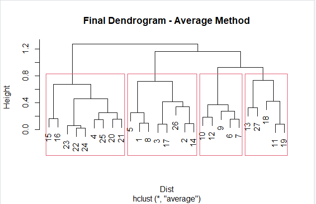
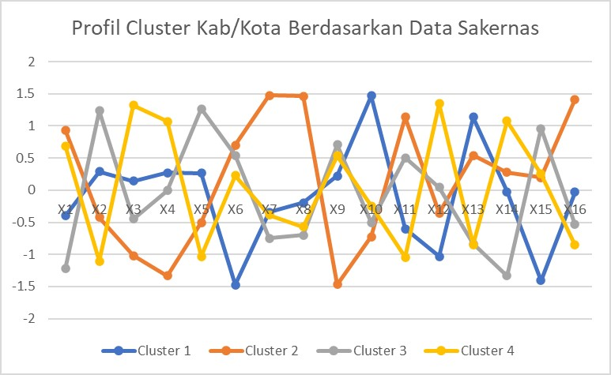

<p align="center">
  
</p>

<p align="center">


## Deskripsi Proyek

Proyek ini bertujuan untuk mengelompokkan 27 kabupaten/kota di Provinsi Jawa Barat berdasarkan karakteristik usaha menggunakan kombinasi **Principal Component Analysis (PCA) Biplot** dan **Hierarchical Clustering**.

Analisis dilakukan sebagai bagian dari penyusunan strategi pelaksanaan **Sensus Ekonomi 2026 (SE2026)** untuk memahami karakteristik wilayah sehingga pendekatan pendataan dapat disesuaikan dengan kondisi masing-masing kabupaten/kota.

---

## Latar Belakang

Karakteristik usaha di setiap wilayah di Jawa Barat sangat beragam, mulai dari bentuk usaha, sektor usaha, pemanfaatan teknologi digital, karakteristik pengusaha, hingga lokasi usaha.

Perbedaan tersebut menyebabkan setiap wilayah memerlukan strategi pendataan yang berbeda agar pelaksanaan Sensus Ekonomi berjalan lebih efektif dan efisien.

Melalui analisis statistik multivariat, wilayah yang memiliki karakteristik serupa dapat dikelompokkan sehingga penyusunan strategi lapangan menjadi lebih terarah.

---

## Tujuan

- Mereduksi 16 variabel karakteristik usaha menggunakan Principal Component Analysis (PCA).
- Memvisualisasikan hubungan antar variabel dan kabupaten/kota menggunakan PCA Biplot.
- Mengelompokkan kabupaten/kota berdasarkan kemiripan karakteristik usaha.
- Mengidentifikasi karakteristik dominan pada setiap klaster.
- Memberikan rekomendasi strategi pendekatan wilayah untuk mendukung pelaksanaan Sensus Ekonomi 2026.

---

## Dataset

**Sumber Data**

Survei Angkatan Kerja Nasional (SAKERNAS) – Badan Pusat Statistik (BPS)

**Unit Analisis**

- 27 Kabupaten/Kota di Provinsi Jawa Barat

**Jumlah Variabel**

- 16 variabel karakteristik usaha

---

## Alur Analisis

<p align="center">
  
</p>

---

## Metode yang Digunakan

- Principal Component Analysis (PCA)
- Singular Value Decomposition (SVD)
- PCA Biplot
- Cosine Correlation
- Agglomerative Hierarchical Clustering
- Average Linkage
- Cophenetic Correlation
- Cluster Profiling

---

## Hasil Analisis

### Principal Component Analysis

- 16 variabel berhasil direduksi menjadi **4 Principal Components**.
- Empat komponen utama mampu menjelaskan **70,85%** keragaman data.

---

### Pemilihan Metode Clustering

Perbandingan metode dilakukan menggunakan nilai **Cophenetic Correlation**.

| Metode | Nilai |
|---------|------:|
| Single Linkage | 0,6003 |
| Complete Linkage | 0,6368 |
| Average Linkage | **0,6975** |
| Ward | 0,6604 |
| Centroid | 0,6678 |

Metode **Average Linkage** dipilih karena menghasilkan nilai Cophenetic Correlation tertinggi.

<p align="center">
  
</p>

---

## Ringkasan Klaster

<p align="center">
  
</p>

### Klaster 1

Karakteristik:

- Usaha perseorangan/rumah tangga
- Sektor industri dan perdagangan
- Belum memanfaatkan marketplace/media sosial
- Didominasi pengusaha Gen Z
- Lokasi usaha di rumah

Rekomendasi:

Pendataan door-to-door dengan fokus pada identifikasi usaha rumah tangga.

---

### Klaster 2

Karakteristik:

- Usaha berbentuk lembaga profit
- Tingkat digitalisasi tinggi
- Penggunaan marketplace dan media sosial
- Persentase industri besar tinggi

Rekomendasi:

Kombinasi pendataan lapangan dan pemanfaatan data administrasi.

---

### Klaster 3

Karakteristik:

- Usaha informal
- Sektor perdagangan
- Lokasi usaha tidak tetap
- Pemanfaatan teknologi digital masih rendah

Rekomendasi:

Pendataan di lokasi keramaian seperti pasar dan pusat perdagangan.

---

### Klaster 4

Karakteristik:

- Usaha formal
- Sektor industri
- Didominasi pengusaha generasi senior
- Lokasi usaha di kantor, pasar, dan pusat perdagangan

Rekomendasi:

Koordinasi dengan pengelola kawasan usaha dan verifikasi administrasi usaha.

---

## Struktur Repository
```text
├── PCA-Biplot-Cluster Hierarki data sakernas.R
├── hasil_clustering.xlsx
├── karakter_cluster.docx
├── images/
│   ├── banner.jpg
│   ├── dendogram.png
│   ├── profil_cluster.jpg
│   └── workflow.jpg
│
└── README.md
```

---

## Catatan

Repository ini dibuat sebagai dokumentasi implementasi metode statistik multivariat pada studi kasus karakteristik usaha di Provinsi Jawa Barat yang dilakukan selama penulis menjadi intern.

Kode yang disediakan bertujuan untuk menunjukkan proses analisis, mulai dari reduksi dimensi hingga pembentukan klaster dan interpretasi hasil.

---

## Disclaimer

**Data yang digunakan dalam proyek ini berasal dari Survei Angkatan Kerja Nasional (SAKERNAS) yang dikelola oleh Badan Pusat Statistik (BPS).**

Sesuai dengan ketentuan pengelolaan data BPS, **data mentah tidak dapat dipublikasikan maupun disebarluaskan**. Oleh karena itu, repository ini **tidak menyertakan dataset asli**. Seluruh hasil yang ditampilkan hanya digunakan untuk keperluan dokumentasi portofolio dan demonstrasi metode analisis.

Apabila ingin mereplikasi analisis, silakan menggunakan data yang memiliki izin penggunaan atau dataset serupa yang tersedia untuk publik.

---

Jika Anda ingin mendiskusikan proyek ini atau menjajaki peluang kerja sama, silakan hubungi saya.

[](https://www.linkedin.com/in/anggie-alnurin-prasetya)

[](https://medium.com/@anggiealnurin27)
